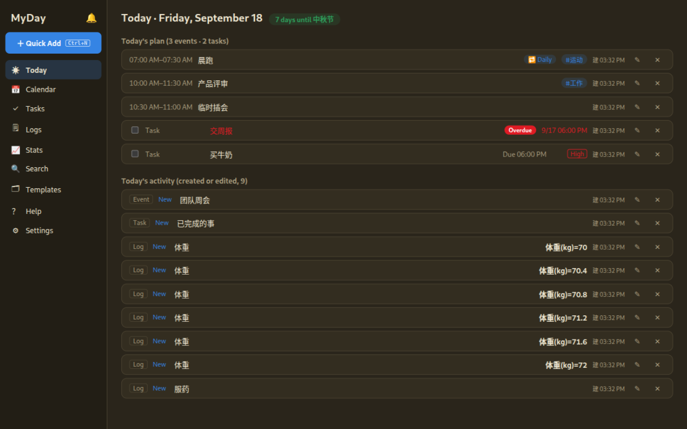
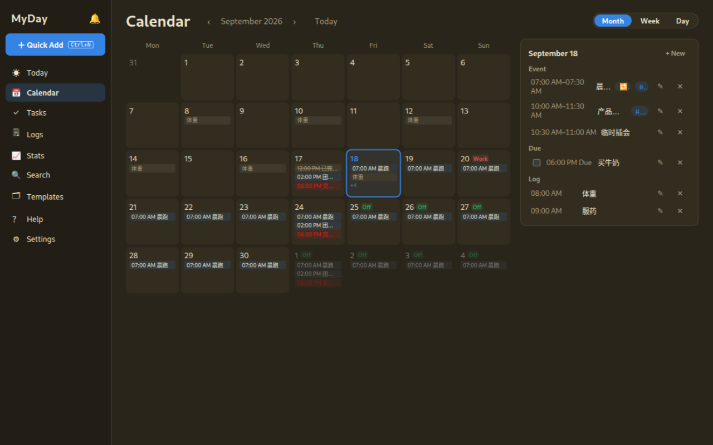
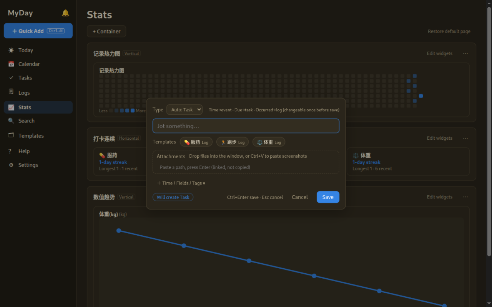
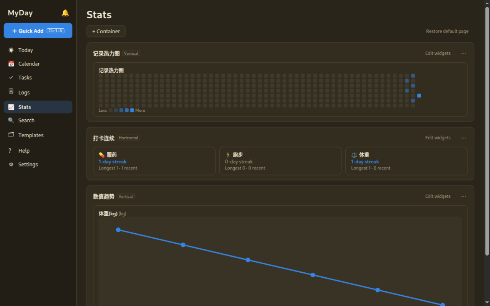

[English](README.md) · [中文](README.zh-CN.md)

# MyDay


**MyDay** is an offline-first personal planner for Linux and Windows: events,
tasks, and logs in one local SQLite database, with a reliable reminder engine
and a full CLI that scripts and AI agents can drive.

- **Fast capture** — a global-hotkey mini window: type a title, press Enter. The
  type is inferred from what you fill in (due → task, time → event, bare text →
  task inbox).
- **Three item types, one model** — events (things that happen), tasks (things
  to finish), logs (things that happened) share one table, one search, one CLI.
- **Reliable reminders** — reminders are stored as *intent* ("10 min before
  start"), so they follow reschedules automatically; missed notifications are
  summarized instead of spamming.
- **Programmable** — every operation is a `myday` CLI command with a stable
  `--json` envelope, idempotency keys and `--dry-run`.
- **Bilingual UI** — English and Chinese, switchable in Settings.

| | |
|---|---|
|  |  |
|  |  |

More: [week time grid](docs/screenshots/calendar-week-en.png).

## Highlights

- **Calendar** — month / week / day views; drag to reschedule (15-min snap),
  drag edges to resize, drag-select to create; recurrence (`@daily`, `@weekly:n`,
  `@monthly:d`, "edit whole series"); Chinese public holiday badges (JSON data,
  importable); conflict hints; `T` / `D` / `W` / `M` / `←` `→` shortcuts.
- **Tasks** — Today / Upcoming / All / Done views, batch complete / reschedule /
  delete with 5-second undo; recurring tasks advance to the next occurrence on
  completion.
- **Logs & stats** — template-based one-tap logging (weight, meds, runs…);
  composable dashboard widgets (heatmap, streaks, trends) with switchable chart
  types on the same data.
- **Today overlay** — a borderless always-on-top mini window listing today's
  unfinished items; lock it click-through, adjust opacity, position and size.
- **View model** — Anytype-style filters (two-level AND/OR, dynamic relative
  dates) and multi-level sort on every list; the GUI and `myday item query`
  share the same evaluation engine.
- **Data you own** — plain SQLite + attachment folder under
  `~/.local/share/myday/`; copy the directory to migrate; one-click zip backup
  (keeps 7); ICS export (RRULE + VALARM); schema upgrades are additive —
  since 1.0 a missing migration refuses to open rather than ever rebuilding.

## Quick start

Requirements: Rust 1.98+ (rustup), Node 22 + pnpm; on Linux also
`libwebkit2gtk-4.1-dev build-essential curl wget file libxdo-dev libssl-dev libayatana-appindicator3-dev`.

```bash
cargo build                # build CLI + core
cargo test                 # core / CLI / desktop tests
cd apps/desktop
pnpm install
pnpm tauri dev             # run the desktop app (dev mode)
pnpm tauri build           # produce the deb installer
./scripts/build-windows.sh # cross-build the Windows NSIS installer from Linux
```

## CLI

The GUI and the CLI share the same database — writes from either side show up
live in the other (local IPC; when the GUI is closed the CLI writes directly).

```bash
myday item add --title "Buy milk" --due 2026-09-16        # bare text defaults to task
myday item add --title "Review" --start "2026-09-16T14:30" --end "2026-09-16T15:30"
myday item add --title "Weekly report" --due 2026-09-23 --recurse @weekly:3
myday item complete <id>      # recurring tasks advance to the next occurrence
myday item query --view view_builtin_tasks_today --json   # same engine as the GUI
myday search "kickoff" --json
myday stats --days 30 --json
myday export ics --output ~/calendar.ics
myday backup                  # zip of db + attachments, keeps 7
echo '{"title":"Call mom","due_at":"2026-09-16T00:00:00Z"}' | myday item add --stdin --json
myday item add ... --dry-run --idempotency-key agent-1
```

- Stable envelope: `{"ok":true,"data":…}` / `{"ok":false,"error":{code,message}}`;
  exit codes `0` ok · `1` error · `2` usage · `3` not found · `4` conflict.
- Time parsing is strict (`2026-09-16T14:30`, `2026-09-16`, RFC3339) — no silent
  guessing, ever.

## Design notes

- Type is fixed at creation (DB trigger); you may change it once before saving.
- Custom fields (Notion-style) live in `extra` JSON keyed by field id — renames
  are free, deletes are soft.
- Reminders store relative specs (`@start-10m`, `@due-1h`, `@dailyT09:00`);
  a catch-up window (default 120 min) turns long-absence misses into a single
  summary notification.
- More in [docs/](docs/): [architecture](docs/ARCHITECTURE.md) ·
  [feature inventory](docs/FEATURE-INVENTORY.md) ·
  [interaction spec](docs/INTERACTION.md) · [view/filter model](docs/FILTER-SPEC.md) ·
  [overlay window](docs/OVERLAY-SPEC.md) · [e2e testing](docs/E2E.md).

## Roadmap

- Unscheduled-tasks backlog (drag undated tasks onto the calendar)
- Single-occurrence exception editing for recurring items; ICS subscription
- Windows installer is cross-built from Linux; macOS is not built yet

See [CHANGELOG.md](CHANGELOG.md) for the release history.

## License

[MIT](LICENSE)
