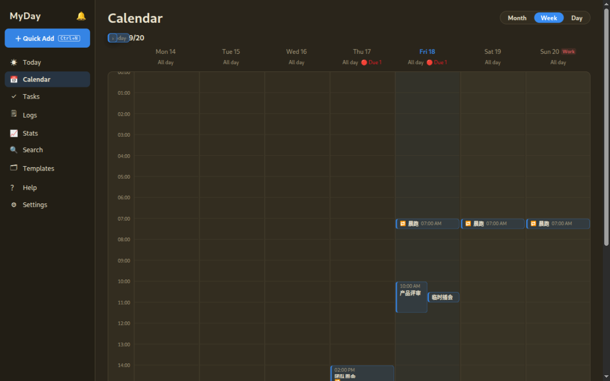

[English](README.md) · [中文](README.zh-CN.md)

<div align="center">

# MyDay

**一个窗口装下你的一天，一个文件装下你的数据，一行命令调用一切。**


[](docs/screenshots/today-en.png)

一个面向 Linux 与 Windows 的个人规划工具，拒绝把一天拆进三个应用：日历、
待办、日志共用同一个本地 SQLite 文件——没有账号，没有同步，没有云。
Rust 核心 + Tauri 外壳，外加一条把脚本和 AI agent 当成一等公民的命令行。

**[下载](#开始使用) · [CLI](#cli-是产品本身) · [English](README.md)**

</div>

## 这个工具的由来

日历知道将要发生什么，待办应用知道必须完成什么，日志知道实际发生了什么。
把它们拆在三个产品里，一天就被拆进了三个孤岛，最后只能靠某个云服务把碎片
粘回来。MyDay 把三者放进**你机器上的同一个文件**，其他一切都盖在上面：

- **几秒完成录入。** 全局快捷键唤起一个极简输入框：打标题，回车，结束。
  填了什么就成为什么——填截止变待办，填时间变日程，纯文本进收件箱。
  MyDay 从不要求你先选类型。
- **可以托付的提醒。** 提醒存的是意图（「开始前 10 分钟」），不是写死的
  时刻。会议改期，提醒自动跟上；一觉睡过一周的通知，等来的是一条整洁的
  摘要，而不是通知风暴。
- **确定性是刻意的。** 在各家应用争相解析自然语言然后听天由命的时代，
  MyDay 反着下注：严格的时间格式、明确的错误码、绝不静默改写。它不懂的
  时候会直说。
- **为 agent 而生。** 界面里的每个动作都是一条 `myday` 命令：稳定的 JSON
  信封、幂等键、`--dry-run`。CLI 不是附属品，它是产品的另一半——你的
  自动化和屏幕上的窗口读写的是同一个数据库。

| | |
|---|---|
| [](docs/screenshots/calendar-month-en.png) | [](docs/screenshots/quick-add-en.png) |
| [](docs/screenshots/calendar-week-en.png) | [](docs/screenshots/stats-en.png) |

带节假日角标的月网格、自动识别类型的录入窗、为拖拽而生的周时间网格、
可以像挂件一样重排的统计面板。

## 它能做什么

- **日历**：月 / 周 / 日三视图。拖块改期（15 分钟吸附）、拖边调时长、空白
  拖选创建、把待办从当天面板拖进任意日期格。重复规则遵循「修改整个系列」
  语义——把重复块拖到另一个星期几，规则会自己改写。
- **待办**：今天 / 即将到期 / 全部 / 已完成四视图，批量操作配五秒撤销；
  重复待办完成后自动推进到下一期。
- **记录**：把模板（服药、体重、跑步）钉在日志页一键记录；统计面板把
  同一份数据变成热力图、连续打卡和趋势线，图表类型随时互换。
- **今日悬浮窗**：无边框置顶小窗，常驻列出今天未完成的事。可锁定为点击
  穿透，透明度可调，角落安家。
- **视图**：每个列表都有 Anytype 式的筛选与排序；界面和 `myday item query`
  走的是同一个求值引擎。
- **中英双语**：界面完整双语，设置页即切；连托盘菜单和系统通知都跟着换。

## 开始使用

Rust 1.98+、Node 22 + pnpm；Linux 另需
`libwebkit2gtk-4.1-dev build-essential curl wget file libxdo-dev libssl-dev libayatana-appindicator3-dev`。

```bash
cargo build                # CLI + 核心库
cargo test                 # core / CLI / 桌面端测试
cd apps/desktop
pnpm install
pnpm tauri dev             # 运行桌面应用
pnpm tauri build           # 产出 deb 安装包
./scripts/build-windows.sh # 从 Linux 交叉构建 Windows NSIS 安装包
```

数据在 `~/.local/share/myday/`——一个 SQLite 库加一个附件目录。复制目录
即迁移，一条命令即备份，schema 升级只向前走。

## CLI 是产品本身

```bash
myday item add --title "买牛奶" --due 2026-09-16           # 纯文本默认待办
myday item add --title "评审" --start "2026-09-16T14:30" --end "2026-09-16T15:30"
myday item add --title "交周报" --due 2026-09-23 --recurse @weekly:3
myday item complete <id>      # 重复待办完成后推进到下一期
myday item query --view view_builtin_tasks_today --json  # 与界面同一求值引擎
myday search "启动会" --json
myday stats --days 30 --json
myday export ics --output ~/calendar.ics
myday backup                  # 数据库 + 附件打包 zip，保留 7 份
echo '{"title":"给妈妈打电话","due_at":"2026-09-16T00:00:00Z"}' | myday item add --stdin --json
myday item add ... --dry-run --idempotency-key agent-1
```

稳定信封 `{"ok":true,"data":…}` / `{"ok":false,"error":{code,message}}`；
退出码 `0` 成功 · `1` 错误 · `2` 参数 · `3` 未找到 · `4` 冲突。语法只写
一遍并保持向后兼容——一个砸了调用方的 CLI，就砸了它存在的意义。

## 设计原则

- **一个文件即真相。** 日程、待办、记录全在 `items` 一张表，约束下放数据
  库——就算有人绕过应用直接开 `sqlite3`，也改不坏模型。
- **类型即命运。** 条目类型创建即定（保存前可改口一次）。确定性优先于
  灵活性。
- **字段是 Notion 式的。** 自定义字段住在注册表里：改名零成本，删除是
  软删，历史从不重写。
- **升级绝不吞数据。** schema 变更只以附加式迁移交付；缺迁移步骤时，
  MyDay 宁愿拒绝打开，也不会重建。

更多文档在 [docs/](docs/)：[架构](docs/ARCHITECTURE.md) ·
[功能清单](docs/FEATURE-INVENTORY.md) · [交互定稿](docs/INTERACTION.md) ·
[视图模型](docs/FILTER-SPEC.md) · [悬浮窗](docs/OVERLAY-SPEC.md) ·
[E2E 测试](docs/E2E.md)。

## 路线图

- 未排期待办池：把无日期待办拖上日历
- 重复条目的单次例外修改；ICS 订阅
- macOS 构建

更新日志见 [CHANGELOG.md](CHANGELOG.md) · 许可证 [MIT](LICENSE)
